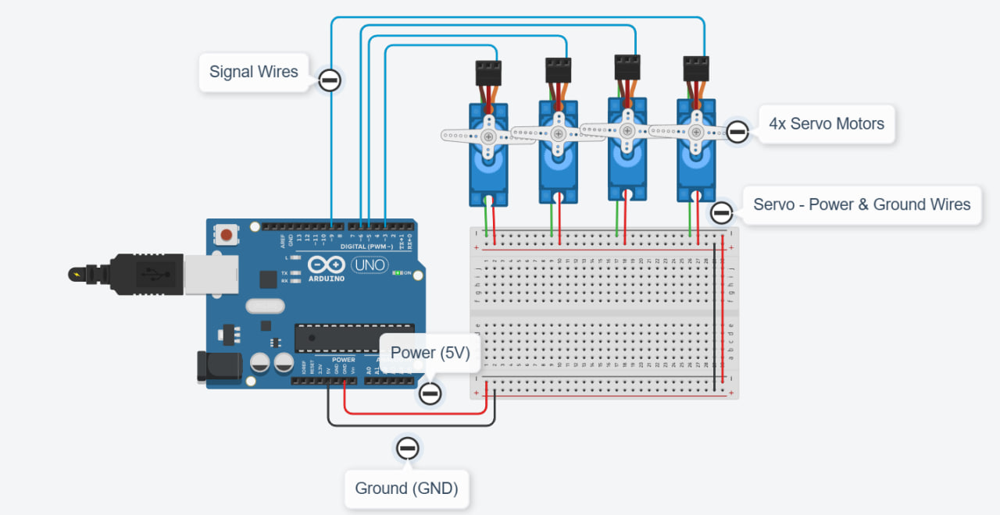

# Four Servo Motor Control

## 📌 Project Overview

This project demonstrates how to control four servo motors using an Arduino.

The four servo motors perform a sweep motion for 2 seconds. After that, all motors move to and hold at 90 degrees.

## 🎯 Task Requirements

- Program 4 servo motors.
- Run the Sweep motion for 2 seconds.
- After 2 seconds, move all servo motors to 90 degrees.
- Keep all motors holding at 90 degrees.

## 🛠️ Components

- Arduino Uno
- 4 Servo Motors
- Breadboard
- Jumper Wires

## 🔌 Servo Motor Connections

| Servo Motor | Arduino Pin |
|-------------|-------------|
| Servo 1 | 3 |
| Servo 2 | 5 |
| Servo 3 | 6 |
| Servo 4 | 9 |

## ⚙️ How It Works

1. The four servo motors start performing a sweep motion.
2. The sweep continues for 2 seconds.
3. After 2 seconds, all servo motors move to 90 degrees.
4. The motors remain fixed at 90 degrees.

## 📷 Circuit Design

## 🎥 Project Demo

[Watch the Project Demo](servo-demo.mp4)

## 💻 Source Code

The Arduino source code is available in this repository:

`four_servo_control.ino`

## 👩‍💻 Author

**Aryam Aseiri**

Summer Training 2026  
Smart Methods
